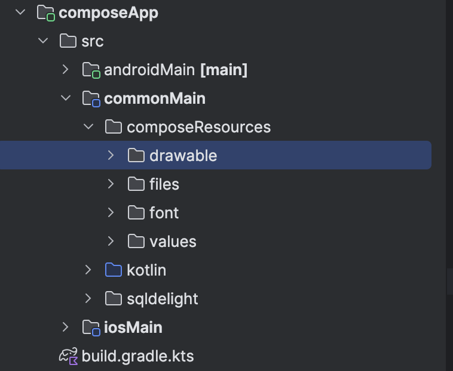

# Вимоги для Compose Multiplatform Фріланс Застосунків

Цей туторіал описує вимоги та налаштування для створення Compose Multiplatform фріланс застосунків на Kotlin.

## 1. Генерація проекту

1. Перейдіть на сайт для створення проекту [KMP Generator](https://kmp.jetbrains.com/).
2. Введіть **Project ID** (бандл додатку), який має починатися з **com**.
3. У налаштуваннях виберіть тільки **Android** та **iOS**.
4. Скачайте архів з проектом та розпакуйте його.
5. Відкрийте проект в Android Studio.

<div style="display: flex;">
 
 
</div>


**Примітка:** Для роботи з Kotlin Multiplatform необхідно встановити плагін Kotlin Multiplatform для Android Studio. Детальніше можна прочитати в [офіційній документації](https://www.jetbrains.com/help/kotlin-multiplatform-dev/compose-multiplatform-create-first-app.html#create-a-project-using-the-wizard).

## 2. Початкові налаштування

1. Оновіть файл `.gitignore`. Приклад файлу можна знайти [тут](https://gist.github.com/vg-afk/133b0e9c88dd6e2e70a7b16343d0baa0#file-gitignoreexample-txt).
2. Встановіть актуальні версії бібліотек. Приклад налаштувань можна подивитись [тут](https://gist.github.com/vg-afk/6ce55050b08b398fa3aba7abcfad63a4).

## 3. Структура проекту

### Код

Весь код, за винятком нативних функцій, має бути написаний у модулі `commonMain`. Структура папок може бути довільною, але можна використовувати структуру, подібну до показаної на скріншоті.


### Ресурси

Усі ресурси (тексти, картинки, шрифти, файли) повинні знаходитися в папці `composeResources`. Деталі про ресурси можна знайти [тут](https://www.jetbrains.com/help/kotlin-multiplatform-dev/compose-multiplatform-resources-setup.html).

#### Формат іменування:

- **Зображення**: всі зображення мають бути у форматі `.png`. Іменуються за шаблоном: `img_<what>.png`. Наприклад, `img_team_placeholder.png`.
- **Векторні іконки**: повинні бути у форматі `.xml`. Іменуються за шаблоном: `ic_<what>.xml`. Наприклад, `ic_settings.xml`.
- **Шрифти**: мають бути у папці `font` і іменуються за шаблоном: `<font_name>_<style>.ttf`. Наприклад, `saira_bold.ttf`, `saira_medium.ttf`.
- **Текстові рядки**: знаходяться в папці `values` у файлі `strings.xml`.
- **Інші файли (звук, анімація)**: повинні бути в папці `files`.



### Стилі тексту:

Стилі тексту мають додаватися через MaterialTheme.typography, а не окремими параметрами індивідуально до кожного елемента тексту. Приклад

```kotlin
Text(
    text = gameModel.activity.type,
    style = MaterialTheme.typography.labelLarge,
    color = MaterialTheme.colorScheme.primary,
    overflow = TextOverflow.Ellipsis,
    modifier = Modifier
        .weight(1f)
        .padding(horizontal = 8.dp)
)
```

### Важливо:

Частини цих папок чи файлів не буде при створенні проекту, тому їх потрібно буде створити самому.

## 4. Бібліотеки та інструменти

### Використовувані бібліотеки:

- [**Coil**](https://github.com/coil-kt/coil): Для завантаження фото з інтернету.
- [**Ktor**](https://github.com/ktorio/ktor): Для запитів в інтернет.
  Створюємо функцію на клієнт в модулі `commonMain` в файлі `Platform.kt`, [пркилад](https://gist.github.com/vg-afk/e6db61a9fd7fb4ae8d0f4b345e327319). Далі потрібно створити реалізацію для кожної платформи в модулі `androidMain` файл `Platform.android.kt`, [приклад](https://gist.github.com/vg-afk/9b0b7f332921e7d9b727706d04a2b6d1). Та в модулі `iosMain` файл `Platform.ios.kt`, [приклад](https://gist.github.com/vg-afk/49a3e3b4e9d310c841c3340d1079a796). Після цього потрібно створити кліент в Koin, [приклад](https://gist.github.com/vg-afk/8452d485fe36bd87b93b02c11cb38cb9)
- [**SqlDelight**](https://github.com/sqldelight/sqldelight): Для бази даних (Room можна використовувати тільки в крайньому випадку).
- [**Koin**](https://github.com/InsertKoinIO/koin): Для Dependency Injection.
- [**Compottie**](https://github.com/alexzhirkevich/compottie): Для анімацій з Lottie.
- [**Jetbrains Compose Navigation**](https://www.jetbrains.com/help/kotlin-multiplatform-dev/compose-navigation-routing.html): Для навігації(Крім імпортів нічим не відрізняється від навігації на Android Jetpack Compose).
- [**Kermit**](https://github.com/touchlab/Kermit): Для логування в проекті.

### Приклад використання Kermit для логування:

```kotlin
Logger.e(ex) { "Something failed" }
```
Логи мають бути видалені після здачі проекту.

## 5. Робота з нативними функціями

Щоб використовувати нативні функції, необхідно реалізувати їх через інтерфейси або за допомогою `expect/actual`.

### Приклад:

#### Інтерфейс для SharedPreferences:

1. Створіть інтерфейс у модулі `commonMain`. Приклад можна знайти [тут](https://gist.github.com/vg-afk/c0a238a537f7e7e0143aceb7463bab7b).
2. Реалізуйте інтерфейс у модулі `androidMain`. Приклад [тут](https://gist.github.com/vg-afk/df8fc2b0102f76e6cc35889ea2c74fb9).
3. Використовуйте клас через Koin у потрібних місцях.

#### Створення класу `PlatformUtils` з нативними функціями платформ а допомогою `expect/actual`:

1. Створіть клас у `commonMain` у папці `utils`. Приклад можна знайти [тут](https://gist.github.com/vg-afk/936d9a82d3692ba2203001a3d4680823).
2. Реалізуйте клас для Android у модулі `androidMain`. Приклад можна знайти [тут](https://gist.github.com/vg-afk/16efef035f567f39c6c26052bce07fe7).
3. Для айос також потрібно створити цей клас, проте тіло функцій можна залишити пустим
4. Використовуйте клас через Koin у потрібних місцях.

#### Важливо:

Шлях до класу в інших модулях має збігатися з шляхом у `commonMain`. Якщо файл у `commonMain` знаходиться за шляхом:
```
commonMain/kotlin/com/myapp/app/utils/PlatformUtils.kt
```
то у модулі `androidMain` він має бути за тим самим шляхом:
```
androidMain/kotlin/com/myapp/app/utils/PlatformUtils.android.kt
```
Те ж саме стосується модуля iOS.
```
iosMain/kotlin/com/myapp/app/utils/PlatformUtils.ios.kt
```

## Використання Material 3

Для того, щоб використовувати **Material 3**, потрібно відредагувати імпорт просто додавши цифру 3 вкінці:

```kotlin
implementation(compose.material) на implementation(compose.material3)
```


## 6. Приклад налаштування build.gradle.kts

Приклад файлу build.gradle.kts можна переглянути [тут](https://gist.github.com/vg-afk/662a0af4782ad93b073e18b50677418c).

## 7. Запитання

Якщо у вас є питання або вам щось не зрозуміло, не соромтесь звертатися в особисті повідомлення.
